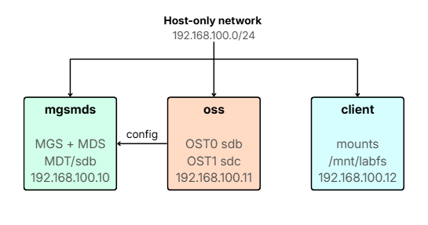
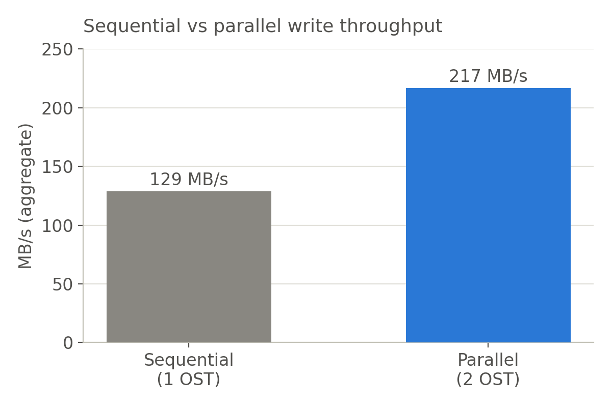
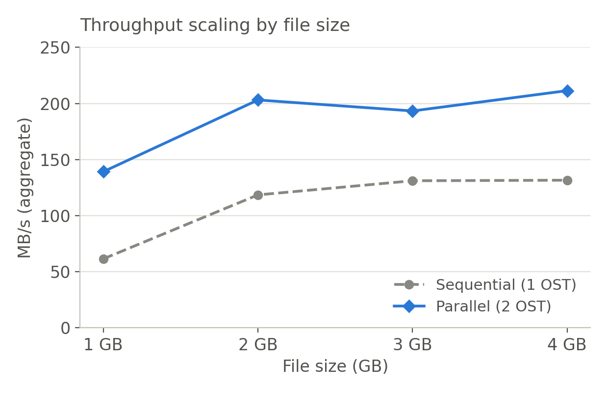
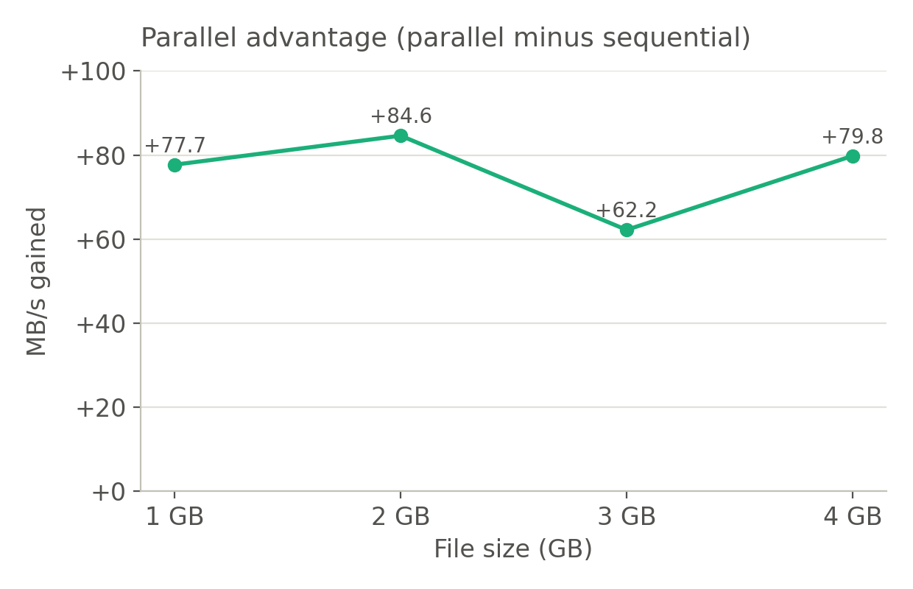

[README_v2.md](https://github.com/user-attachments/files/30072084/README_v2.md)
# Lustre HPC Lab

A hands-on lab for building a working [Lustre](https://www.lustre.org/) parallel filesystem across three virtual machines using VMware Workstation. The goal is to understand — end-to-end — how the MGS, MDS, OSS, and client roles fit together, and to prove that a client on one VM can read and write files stored on OSTs hosted on a different VM.

The lab currently runs a two-OST filesystem (`labfs`, ~18.4 GB usable), survives cold reboot via `/etc/fstab`, and has repeatable bring-up scripts that have been exercised on real VMs.

---

## Architecture

Three VMs, each with a single Lustre role. `oss` hosts two OSTs on two separate disks.



| VM       | Role              | Host-only IP     | Lustre disk(s)                     | Mount point(s)                |
| -------- | ----------------- | ---------------- | ---------------------------------- | ----------------------------- |
| `mgsmds` | MGS + MDS         | `192.168.100.10` | `/dev/sdb` (10 GB, MDT)            | `/mnt/mdt`                    |
| `oss`    | OSS               | `192.168.100.11` | `/dev/sdb` (10 GB, OST0) + `/dev/sdc` (10 GB, OST1) | `/mnt/ost`, `/mnt/ost2` |
| `client` | Lustre client     | `192.168.100.12` | — (no extra disk)                  | `/mnt/labfs`                  |

Filesystem name: **`labfs`** — 1 MDT + 2 OSTs, ~18.4 GB usable.

> **Note:** Linux `/dev/sdX` names are not guaranteed stable across reboots. On `mgsmds` the MDT disk was originally `/dev/sda` but became `/dev/sdb` after the first reboot. Always confirm with `lsblk` before running `mkfs.lustre`, and always mount by `UUID=` in `/etc/fstab`, never by device name (see [Troubleshooting](#troubleshooting)).

---

## Environment

| Component            | Version                                   |
| -------------------- | ----------------------------------------- |
| Hypervisor           | VMware Workstation                        |
| Guest OS             | Rocky Linux **9.4** (Minimal)             |
| Lustre               | **2.16.1** (server + client, el9.4 RPMs)  |
| Server kernel        | `5.14.0-427.31.1_lustre.el9.x86_64`       |
| Client kernel        | `5.14.0-427.13.1.el9_4.x86_64` (stock)    |
| Networking (LNet)    | `tcp0` over host-only `192.168.100.0/24`  |

Per-VM sizing: 2 vCPU, 2 GB RAM, 20 GB OS disk, plus a 10 GB raw disk on `mgsmds` (MDT) and two 10 GB raw disks on `oss` (OST0 + OST1).

Rocky 9.4 is deliberate: the Whamcloud Lustre 2.16.1 server RPMs ship a patched kernel built for el9.4. Newer minor versions of RHEL/Rocky may not have a matching prebuilt kernel.

---

## Networking

Each VM has two NICs:

- **Adapter 1 — VMware Host-only (`VMnet1`)** — carries Lustre traffic on `192.168.100.0/24` (static IPs above).
- **Adapter 2 — NAT** — DHCP, used for internet access (package installs, updates).

`VMnet1`'s subnet was changed from the default `192.168.18.0/24` to `192.168.100.0/24` via VMware's Virtual Network Editor.

`/etc/hosts` on every VM contains:

```
192.168.100.10 mgsmds
192.168.100.11 oss
192.168.100.12 client
```

For the lab, `firewalld` and SELinux are disabled on all three VMs.

---

## Automated bring-up (recommended)

Three helper scripts in the repo root reproduce the post-install configuration end-to-end. They have been run against the live VMs and are idempotent (safe to re-run — they skip `mkfs.lustre` if the target is already formatted and skip `/etc/fstab` edits if an entry already exists).

Run them **as root**, in this order, one VM at a time:

```bash
# On mgsmds
sudo bash setup_mgsmds.sh

# On oss  (only after mgsmds is up and lctl ping mgsmds@tcp0 works)
sudo bash setup_oss.sh

# On client  (only after oss is up)
sudo bash setup_client.sh
```

Each script will:

- Set hostname and `/etc/hosts`, disable `firewalld` + SELinux.
- On server VMs: print `lsblk` and ask you to type the target device name, then require typing `yes` before `mkfs.lustre` — the two-step confirmation is deliberate, since formatting the wrong disk destroys data.
- On the OSS and client: verify LNet connectivity with `lctl ping` before doing anything else.
- Write `/etc/fstab` using `UUID=` (never `/dev/sdX`) so mounts survive device renumbering across reboots.
- Reload systemd (`systemctl daemon-reload`) so the new fstab takes effect without a reboot.

Prerequisite: Lustre server/client RPMs must already be installed and the patched kernel must be booted (see step 3–4 of the manual bring-up below). The scripts configure the filesystem — they do not install packages.

To add a second OST (as this lab does), re-run `setup_oss.sh` with `OST_INDEX=1` and a different `OST_MOUNT` in the CONFIG block.

---

## Manual bring-up (reference)

If you would rather understand each step (or you are running from a clean install with no scripts), the equivalent manual sequence is:

1. **Provision VMs.** Install Rocky 9.4 Minimal on all three; only touch the 20 GB OS disk during install.
2. **Configure the network.** Static IPs on `ens160`, `/etc/hosts` on every VM, disable `firewalld` + SELinux.
3. **Install Lustre server.** On `mgsmds` and `oss`, install the patched kernel and Lustre server RPMs from Whamcloud (`el9.4/server/`), then reboot into the patched kernel.
4. **Install Lustre client.** On `client`, install client RPMs from Whamcloud (`el9.4/client/`) — no patched kernel needed.
5. **Format + mount MDT** on `mgsmds`:
   ```bash
   lsblk   # confirm the empty 10 GB disk
   mkfs.lustre --fsname=labfs --mgs --mdt --index=0 /dev/sdb
   mkdir -p /mnt/mdt && mount -t lustre /dev/sdb /mnt/mdt
   ```
6. **Format + mount OST0** on `oss`:
   ```bash
   lsblk   # confirm the empty 10 GB disk
   mkfs.lustre --fsname=labfs --ost --index=0 --mgsnode=mgsmds@tcp0 /dev/sdb
   mkdir -p /mnt/ost && mount -t lustre /dev/sdb /mnt/ost
   ```
7. **(Optional) Format + mount OST1** on `oss`:
   ```bash
   mkfs.lustre --fsname=labfs --ost --index=1 --mgsnode=mgsmds@tcp0 /dev/sdc
   mkdir -p /mnt/ost2 && mount -t lustre /dev/sdc /mnt/ost2
   ```
8. **Mount from client:**
   ```bash
   mkdir -p /mnt/labfs
   mount -t lustre mgsmds@tcp0:/labfs /mnt/labfs
   ```
9. **Persist across reboots.** Add `_netdev` entries to `/etc/fstab` on every VM using `UUID=` (from `blkid -s UUID -o value /dev/sdX`) on the servers, and the network path on the client. Then `systemctl daemon-reload`.
10. **Verify:**
    ```bash
    echo "hello lustre" > /mnt/labfs/test.txt
    cat  /mnt/labfs/test.txt
    lfs df -h
    ```

---

## Status

- MGS + MDT formatted and mounted on `mgsmds`
- Two OSTs formatted and mounted on `oss` (OST0 on `/dev/sdb`, OST1 on `/dev/sdc`)
- Client mounts `labfs` and can read/write files across the network
- All three VMs use persistent, UUID-based `/etc/fstab` entries and come back cleanly from a cold reboot (boot order: `mgsmds` → `oss` → `client`)
- File striping across both OSTs verified: `lfs setstripe -c 2` produces `lmm_stripe_count: 2` with objects on both `obdidx` 0 and 1
- Parallel write throughput scales with OST count: two concurrent 1 GB writes reach ~217 MB/s aggregate across 2 OSTs vs ~129 MB/s sequentially on one (about 1.68x faster). See [Performance](#performance)

`lfs df -h` from the client reports **~18.4 GB** usable, backed by 1 MDT + 2 OSTs.

---

## Performance

All throughput tests run from `client` with `dd ... oflag=direct`, which bypasses the page cache so the numbers reflect real network and disk throughput rather than RAM caching. Aggregate throughput is total data written divided by wall-clock time.

### Sequential vs parallel writes

Writing two 1 GB files, first one after another on a single OST, then concurrently across both OSTs:



| Layout             | Wall-clock time | Aggregate throughput |
| ------------------ | --------------- | -------------------- |
| Sequential (1 OST) | 15.5 s          | 129 MB/s             |
| Parallel (2 OST)   | 9.2 s           | 217 MB/s             |

Writing across both OSTs in parallel is about 1.68x faster. A single-stream write only engages one OST at a time, leaving the second idle; running two concurrent streams lets both OSTs work at once.

### Scaling with file size

Repeating the comparison across 1, 2, 3, and 4 GB files (each side writes two files of the given size):



| File size | Sequential (1 OST) | Parallel (2 OST) | Speedup |
| --------- | ------------------ | ---------------- | ------- |
| 1 GB      | 61.5 MB/s          | 139.2 MB/s       | 2.26x   |
| 2 GB      | 118.5 MB/s         | 203.1 MB/s       | 1.71x   |
| 3 GB      | 131.1 MB/s         | 193.3 MB/s       | 1.47x   |
| 4 GB      | 131.6 MB/s         | 211.4 MB/s       | 1.61x   |

The 1 GB sequential figure is low because of first-run warm-up. From 2 GB on, sequential settles around 120 to 132 MB/s and parallel around 190 to 211 MB/s.

The parallel advantage (parallel minus sequential) stays roughly constant at about 76 MB/s regardless of file size:



Takeaway: aggregate throughput scales with OST count. Each added OST contributes a fixed slab of write bandwidth, which is the core reason parallel filesystems power HPC.

> Test note: each OST is only ~9.2 GB, so the sequential run (which writes twice the file size onto a single OST) caps at 4 GB. Larger sweeps need bigger OSTs.

---

## Troubleshooting

Handy commands, most run from `client`:

```bash
# LNet reachability
lctl ping mgsmds@tcp0
lctl ping oss@tcp0

# LNet network state
lnetctl net show

# Which filesystem targets are active on this node
lctl dl

# Kernel-side error messages when a mount fails
dmesg | tail -30

# Filesystem summary and per-target health
lfs df -h
lfs check servers

# Boot-time Lustre logs (if fstab mounts fail on reboot)
journalctl -b | grep -i lustre
```

Common symptoms and where to look:

| Symptom                                                    | Likely cause / first check                                                                                          |
| ---------------------------------------------------------- | ------------------------------------------------------------------------------------------------------------------- |
| `mount` hangs / times out                                  | `lctl ping` fails — check `firewalld` is actually disabled and `/etc/hosts` matches on all three VMs.               |
| Client sees 0 bytes / target `INACTIVE`                    | OST not mounted on `oss`. Run `lctl dl` on `oss`; re-mount the OST target.                                          |
| Reboot succeeds but nothing mounts                         | Missing `_netdev` in `/etc/fstab`, or `systemctl daemon-reload` was skipped after editing fstab.                    |
| `mount.lustre: /dev/sdX has not been formatted with mkfs.lustre` | Kernel re-numbered your disks. Compare current `blkid` output to your stored UUIDs, then switch fstab to `UUID=`. This bit us on `mgsmds` — the MDT flipped from `/dev/sda` to `/dev/sdb` between reboots. |
| `blkid` reports `TYPE="ext4"` on a Lustre target           | Expected — the `ldiskfs` backend is ext4-based. Check `LABEL` instead (e.g., `labfs-OST0000`).                       |
| `lfs setstripe: Inappropriate ioctl for device`, and writes suddenly ~10x faster | `/mnt/labfs` is not actually mounted as Lustre, so writes land on the client's local disk. Check `lfs df -h` and `mount \| grep lustre`, then re-mount: `mount -t lustre mgsmds@tcp0:/labfs /mnt/labfs`. |

---

## Roadmap

- [x] Persistent mounts via `/etc/fstab` (UUID-based, `_netdev`)
- [x] Reboot test — full stack comes back cleanly from cold
- [x] Automation scripts for repeatable bring-up (`setup_mgsmds.sh`, `setup_oss.sh`, `setup_client.sh`)
- [x] Multiple OSTs for scale-out testing (`labfs` now runs on 2 OSTs)
- [x] Baseline single-client throughput recorded (71.4 MB/s)
- [x] Parallel write scaling measured (1 vs 2 OST across 1 to 4 GB files)
- [ ] Failover / HA scenarios (needs shared storage — deferred)
- [ ] Broader performance testing (`ost-survey`, `sgpdd-survey`, large-file and concurrent workloads)
- [ ] Auto-detect OST index from label in `setup_oss.sh` (currently manual via `OST_INDEX` in the CONFIG block)

---

## Repository layout

```
.
├── README.md              # this file
├── setup_mgsmds.sh        # bring-up script for the MGS/MDS node
├── setup_oss.sh           # bring-up script for the OSS node
├── setup_client.sh        # bring-up script for the client node
├── assets/                # diagram and performance charts used in this README
├── client/                # VMware VM (not tracked — see .gitignore)
├── mgsmds/                # VMware VM (not tracked — see .gitignore)
└── oss/                   # VMware VM (not tracked — see .gitignore)
```

The VMware VM directories contain multi-GB `.vmdk`, `.vmem`, and `.vmss` files that are **not** suitable for GitHub. A recommended `.gitignore`:

```gitignore
# VMware virtual machine binaries and runtime state
*.vmdk
*.vmem
*.vmss
*.vmsn
*.vmsd
*.vmx
*.vmxf
*.nvram
*.scoreboard
*.log
mksSandbox*.log
vmware*.log
client/
mgsmds/
oss/
```

If you want to share VM state, publish an appliance (OVA/OVF) as a release asset instead of committing the raw VMware files.

---

## References

- Lustre documentation — <https://doc.lustre.org/>
- Whamcloud Lustre downloads — <https://downloads.whamcloud.com/public/lustre/>
- Rocky Linux 9.4 Vault ISO — <https://dl.rockylinux.org/vault/rocky/9.4/isos/x86_64/>
